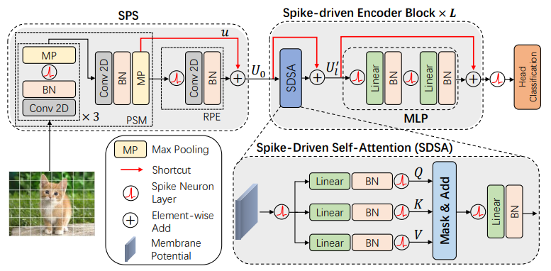
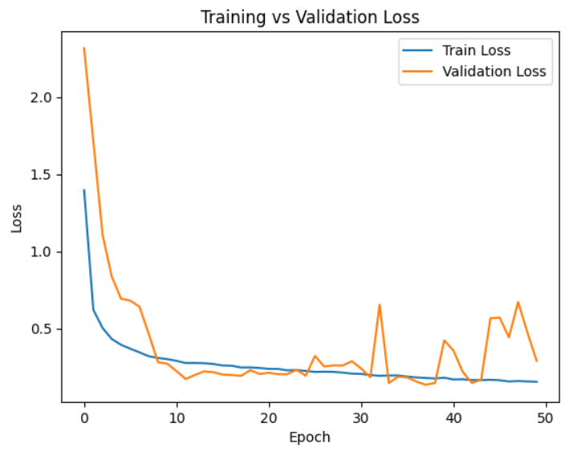
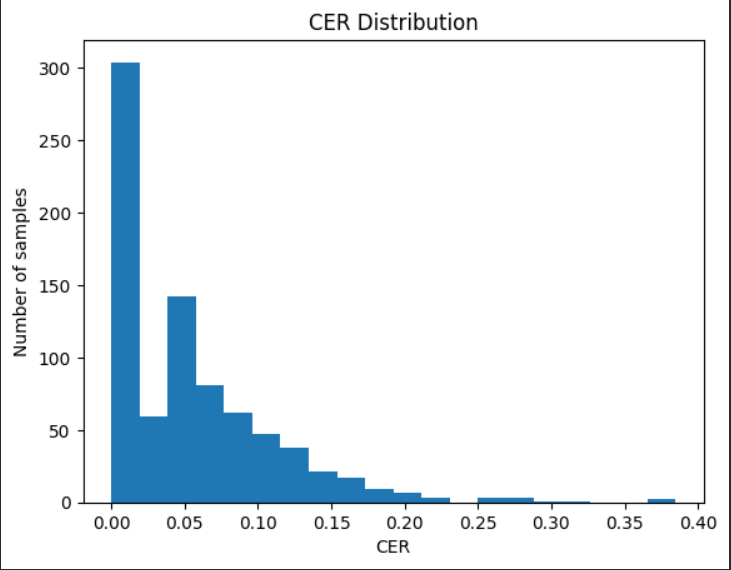

# 🧠 SDT-OCR: Spiking Transformer for Text Transcription

## 🧩 Spike-Driven Transformer (SDT) Architecture (Reference Model)



---

This project focuses on Optical Character Recognition (OCR) using a **Spike-Driven Transformer (SDT)** based on **Spiking Neural Networks (SNNs)**.

---

## 📌 Description

The goal of this project is to transcribe text from images using a biologically inspired neural network architecture.

The model is trained on a **synthetically generated dataset**, making it suitable for controlled OCR experiments.

---

## 🧠 Model Architecture

* Spike-Driven Transformer (SDT)
* Spiking Neural Networks (SNN)
* Sequence modeling for text transcription

---

## 📂 Project Structure

```
models/                # Model architecture (SpikeFormer, SDT)
module/                # Core modules and layers
dataset.py             # Dataset loading and preprocessing
tokenizer.py           # Text encoding / decoding
train.py               # Training script
utils.py               # Utility functions
outputs/               # Training results (models, losses, etc.)
Transcription_de_texte.ipynb  # Visualization (loss curves & test results)
```

---

## 📊 Notebook (Visualization)

The file **Transcription_de_texte.ipynb** is used to:

* Visualize training and validation loss curves
* Evaluate model predictions on test data
* Analyze model performance

---

## 📦 Requirements

This project requires Python 3.8+ and a CUDA-compatible GPU.

The following libraries are needed:

- PyTorch (CUDA 12.1)
- torchvision
- torchaudio
- timm
- spikingjelly
- datasets
- pillow
- numpy
- matplotlib
- tqdm

### 🔧 Installation (GPU only)

```bash
pip install torch torchvision torchaudio --index-url https://download.pytorch.org/whl/cu121
pip install timm spikingjelly datasets pillow numpy matplotlib tqdm
```
---

## ▶️ How to Run

```
python train.py
```

---

## 📈 Results

#### Training Performance



The model shows a stable convergence during training, with both training and validation losses decreasing over epochs.

---

#### Evaluation (Character Error Rate - CER)



The model achieves the following performance on the test set:

- **Mean CER:** 5.17%  
- **Median CER:** 4.17%  
- **Min CER:** 0.0%  
- **Max CER:** 38.46%  

These results indicate that the model performs well on most samples, with a low average error rate, while a few challenging cases lead to higher errors. Further improvements are needed to enhance robustness and reduce errors on difficult samples.

---

## 👤 Author

**Soidad Soule Ahamada**  
MSc Student in Image and Artificial Intelligence
